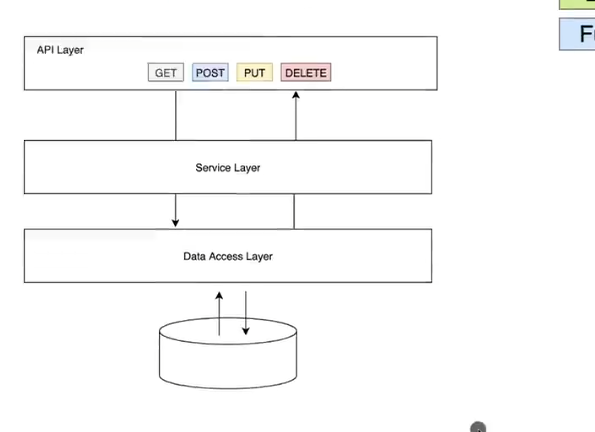
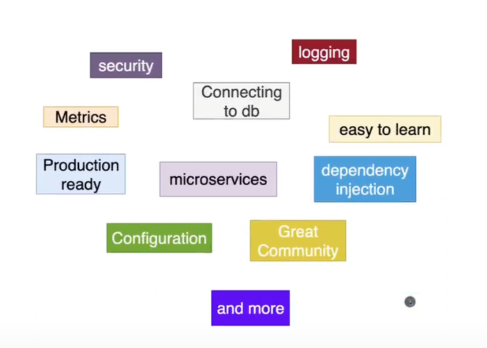
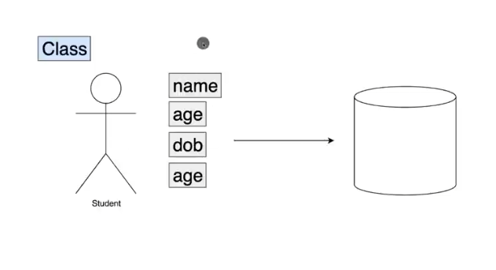
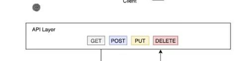
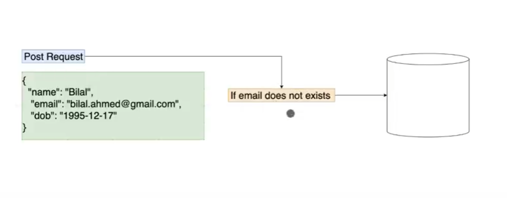

# Learning-Springboot

https://www.youtube.com/watch?v=9SGDpanrc8U





# Course Outline

- In this course we will be building a CRUD application
  - API Layer
  - Service Layer
  - Data Access Layer
- We will use a real database for this one

## 1. Project Initializer

- To start we'll be using spring initializr

## Project Directory

- Tests is for test
- Resources
  - application.properties
    - this is all the properties for all our application
    - as well as environment specific properties
  - static: for static files HTML, CSS, JS
  - template for dynamic files for HTML

## 2. Spring Boot Application

- Firslty since we added springboot-data-jpa dependency when running the application it will fail
- Lets comment out this dependency for now

- Now it will run

- Lets create an API
- @RestController makes the endpoint a rest controller making the class able to serve rest endpoints
- @GetMapping is a get request, we can also use @PostMapping, @PutMapping, @DeleteMapping
- FYI you need to specify route i.e. @GetMapping("/hello")

# Modelling a Person



```java
package dev.shaankhan.learningspringboot.demo.student;

import java.time.LocalDate;
import java.util.Date;

public class Student {
    private long id;
    private String name;
    private int age;
    private LocalDate dateOfBirth;
    private String email;

    public Student() {
    }

    public Student(long id, String name, int age, LocalDate dateOfBirth, String email) {
        this.id = id;
        this.name = name;
        this.age = age;
        this.dateOfBirth = dateOfBirth;
        this.email = email;
    }

    public Student(String name, int age, LocalDate dateOfBirth, String email) {
        this.name = name;
        this.age = age;
        this.dateOfBirth = dateOfBirth;
        this.email = email;
    }

    public long getId() {
        return id;
    }

    public void setId(long id) {
        this.id = id;
    }

    public String getName() {
        return name;
    }

    public void setName(String name) {
        this.name = name;
    }

    public int getAge() {
        return age;
    }

    public void setAge(int age) {
        this.age = age;
    }

    public LocalDate getDateOfBirth() {
        return dateOfBirth;
    }

    public void setDateOfBirth(LocalDate dateOfBirth) {
        this.dateOfBirth = dateOfBirth;
    }

    public String getEmail() {
        return email;
    }

    public void setEmail(String email) {
        this.email = email;
    }

    @Override
    public String toString() {
        return "Student{" +
                "id=" + id +
                ", name='" + name + '\'' +
                ", age=" + age +
                ", dateOfBirth=" + dateOfBirth +
                ", email='" + email + '\'' +
                '}';
    }
}
```

- Project Lombok could remove this boilerplate code as it takes a lot of time

# Consolidating

- now we'll make a controller class consolidating into MVC

```java
@RequestMapping(path="/api/v1/student")
```

- this will be the base route for all the endpoints for the Student package



API layer is now done

- now lets create a service layer that will serve the business logic to our api layer class

N-Tier Design Pattern

## Dependency Injection

- So far we have 3 classes, and within StudentController we have a constructor with studentService
- This won't work since we don't have a studentService
- When writing code though, we don't want to create a new instance of the studentService and should use dependency injection

- We use @Autowired to inject the dependency
- We need to also say the StudentService is a service class that needs to be instiatied
  `@Component`

- This works, but with Spring lets be more specific and call this a `@Service` class
- @Service / @Components are the same thing, but @Service is more specific

## Connecting to a Database

Springboot / SpringDataJPA

```java
package dev.shaankhan.learningspringboot.demo.student;

import jakarta.persistence.*;

import java.time.LocalDate;
import java.util.Date;

@Entity
@Table
public class Student {
    @Id
    @SequenceGenerator(
            name = "student_sequence",
            sequenceName = "student_sequence",
            allocationSize = 1
    )
    @GeneratedValue(
            strategy = GenerationType.SEQUENCE,
            generator = "student_sequence"
    )
    private long id;
    private String name;
    private int age;
    private LocalDate dateOfBirth;
    private String email;

    public Student() {
    }

    public Student(long id, String name, int age, LocalDate dateOfBirth, String email) {
        this.id = id;
        this.name = name;
        this.age = age;
        this.dateOfBirth = dateOfBirth;
        this.email = email;
    }

    public Student(String name, int age, LocalDate dateOfBirth, String email) {
        this.name = name;
        this.age = age;
        this.dateOfBirth = dateOfBirth;
        this.email = email;
    }

    public long getId() {
        return id;
    }

    public void setId(long id) {
        this.id = id;
    }

    public String getName() {
        return name;
    }

    public void setName(String name) {
        this.name = name;
    }

    public int getAge() {
        return age;
    }

    public void setAge(int age) {
        this.age = age;
    }

    public LocalDate getDateOfBirth() {
        return dateOfBirth;
    }

    public void setDateOfBirth(LocalDate dateOfBirth) {
        this.dateOfBirth = dateOfBirth;
    }

    public String getEmail() {
        return email;
    }

    public void setEmail(String email) {
        this.email = email;
    }

    @Override
    public String toString() {
        return "Student{" +
                "id=" + id +
                ", name='" + name + '\'' +
                ", age=" + age +
                ", dateOfBirth=" + dateOfBirth +
                ", email='" + email + '\'' +
                '}';
    }
}
```

- Creating the data access layer

  - Create an interface class called StudentRepository, this is a naming convention for anything that acts as a data access layer database

- Transient menas it won't be a column in the database

## Post Mapping



- We want the request that comes from the body i.e. from the request so we use @RequestBody

## Put Mapping

- This one is very cool as we can use the @Transactional annotation to update the database
- by doing it this way we can use the setters to automatically update the database

https://www.springboottutorial.com/design-patterns-for-beginners-with-java-examples
